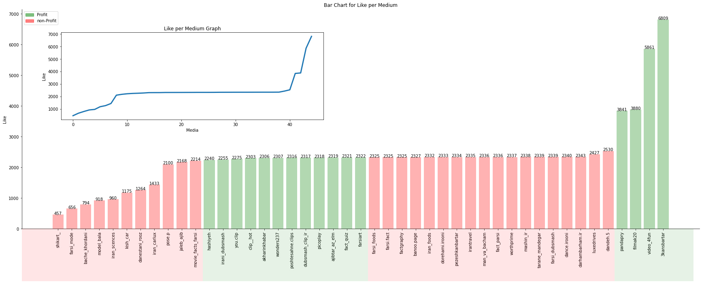

<!-- PROJECT SHIELDS -->


[](https://www.linkedin.com/in/raminferdos/)
[
](mailto:ferdos.ramin@gmail.com)
[](https://simplyramin.github.io/)

<!-- PROJECT LOGO -->
<br />
<div align="center" id=readme-top>
  <h3 align="center">"Bekhatereman" Advertising Campaign Analysis</h3>

  <p align="center">
    Data-Driven Analysis of "Bekhatereman" Advertising Campaign
    <br />
    <a href="https://github.com/SimplyRamin/bekhatereman_campaign_analysis"><strong>Explore the docs »</strong></a>
    <br />
    <br />
    <a href="https://github.com/SimplyRamin/bekhatereman_campaign_analysis">View Demo</a>
    ·
    <a href="https://github.com/SimplyRamin/bekhatereman_campaign_analysis/issues">Report Bug</a>
    ·
    <a href="https://github.com/SimplyRamin/bekhatereman_campaign_analysis/issues">Request Feature</a>
  </p>
</div>


<!-- TABLE OF CONTENTS -->
<details>
  <summary>Table of Contents</summary>
  <ol>
    <li>
      <a href="#about-the-project">About The Project</a>
      <ul>
        <li><a href="#introduction">Introduction</a></li>
        <li><a href="#about-the-campaign">About the Campaign</a></li>
        <li><a href="#project-overview">Project Overview</a></li>
        <li><a href="#methodology">Methodology</a></li>
        <li><a href="#key-findings">Key Findings</a></li>
        <li><a href="#conclusions">Conclusions</a></li>
        <li><a href="#built-with">Built With</a></li>
      </ul>
    </li>
    <li><a href="#usage">Usage</a></li>
    <li><a href="#contributing">Contributing</a></li>
    <li><a href="#license">License</a></li>
    <li><a href="#contact">Contact</a></li>
    <li><a href="#acknowledgments">Acknowledgments</a></li>
  </ol>
</details>


<!-- ABOUT THE PROJECT -->
## About The Project



### Introduction

Welcome to the "Bekhatereman" Campaign Analysis repository! This project delves into the comprehensive analysis of the #bekhatereman campaign, a remarkable 360-degree digital marketing initiative for Mitsubishi Motors in Iran. As a CSR campaign executed by SISARV Marcom Agency, this campaign not only left a lasting impact but also secured recognition as the Best Campaign of the Year in Iran. This repository is the culmination of an in-depth exploration into the campaign's effectiveness, utilizing a data-driven approach.

### About the Campaign
The #bekhatereman campaign was a strategic endeavor aimed at engaging and resonating with the target audience. Spearheaded by SISARV Marcom Agency, where I served as a Key Account Manager and Creative Strategist, this campaign stood out as a testament to the power of innovative digital marketing.

### Project Overview
In this repository, I have meticulously documented the entire analysis process conducted to gauge the effectiveness of the #bekhatereman campaign. To assess the campaign's impact, I employed two distinct approaches:

1. ***Sentiment Analysis***: Leveraging comments and messages from viewers, I conducted sentiment analysis to gain insights into their interactions with campaign assets.

2. ***Advertising Cost Analysis***: I examined the advertising cost of the campaign to provide a quantitative perspective on its performance.

I adhered to the CRISP-DM (Cross-Industry Standard Process for Data Mining) methodology throughout the project, encompassing data imputation, data cleansing, exploratory data analysis, modeling, and more.

### Methodology
My approach to analyzing the #bekhatereman campaign involved rigorous methodologies and data-driven techniques. Here's an overview of the key steps:

- ***Data Preprocessing***: I meticulously handled data imputations and cleansing to ensure the accuracy and reliability of the dataset.

- ***Modeling***: In the modeling phase, I harnessed the power of multiple machine learning systems and algorithms to gain a comprehensive understanding of the campaign's effectiveness. A grid search was performed to identify the optimal algorithm and hyperparameter combinations.

### Key Findings
Through this extensive analysis, I unearthed significant and insightful facts that can be harnessed to enhance the effectiveness of digital marketing campaigns on Instagram. This project also formed the basis of my master's thesis, reflecting the depth and significance of the insights derived.

### Conclusions
The "Bekhatereman" Campaign Analysis repository encapsulates a journey into the heart of a groundbreaking digital marketing campaign. It not only provides a detailed account of the project but also offers valuable insights that can reshape the landscape of digital marketing on social media platforms like Instagram.

### Built With

This research project was powered by a robust set of tools, libraries, and frameworks that facilitated data processing, analysis, and visualization:

- 
 The primary programming language for data manipulation, analysis, and visualization.

-  Used for interactive data exploration, analysis, and documentation, providing an intuitive environment for code execution and visualization.

-  scikit-learn is a versatile machine learning library in Python that offers simple and efficient tools for data analysis and modeling, including classification, regression, clustering, and more.

-  NumPy is a fundamental package for scientific computing with Python, providing support for arrays and matrices, as well as a wide range of mathematical functions.

-  A versatile data manipulation library for cleaning, processing, and analyzing structured data.

-  A powerful statistical data visualization library that enhances the presentation of insights through beautiful and informative plots.

-  A widely-used data visualization library that offers extensive customization and control over plot aesthetics.

<p align="right">(<a href="#readme-top">back to top</a>)</p>

<!-- HOW TO USE THIS REPOSITORY -->
## Usage
- Clone this repository to your local machine if you wish to replicate or build upon the work presented here.
```bash
git clone https://github.com/SimplyRamin/bekhatereman_campaign_analysis.git
```

- Open the notebook you want to check.

<p align="right">(<a href="#readme-top">back to top</a>)</p>

<!-- CONTRIBUTING -->
## Contributing

Contributions are what makes the open-source community such an amazing place to learn, inspire, and create. Any contributions you make are **greatly appreciated**.

If you have a suggestion that would make this better, please fork the repo and create a pull request. You can also simply open an issue with the tag "enhancement".
Don't forget to give the project a star! Thanks again!

1. Fork the Project
2. Create your Feature Branch (`git checkout -b feature/AmazingFeature`)
3. Commit your changes (`git commit -m 'Add some AmazingFeature'`)
4. Push to the Branch (`git push origin feature/AmazingFeature`)
5. Open a Pull Request

<p align="right">(<a href="#readme-top">back to top</a>)</p>


<!-- LICENSE -->
## License

Distributed under the MIT License. See `LICENSE.txt` for more information.

*Disclaimer: This repository is intended for educational and analytical purposes only. All data used has been anonymized and does not infringe upon any privacy rights or intellectual property rights.*

<p align="right">(<a href="#readme-top">back to top</a>)</p>


<!-- CONTACT -->
## Contact

Ramin F. - [@SimplyRamin](https://www.linkedin.com/in/raminferdos/) - ferdos.ramin@gmail.com - [Website](https://bekhatereman_campaign_analysis)

Project Link: [https://github.com/SimplyRamin/bekhatereman_campaign_analysis](https://github.com/SimplyRamin/bekhatereman_campaign_analysis)

<p align="right">(<a href="#readme-top">back to top</a>)</p>


<!-- ACKNOWLEDGMENTS -->
## Acknowledgments

I would like to express my gratitude to the data science community for its constant inspiration and support. This project is a testament to the power of data-driven insights and the endless possibilities they offer in understanding and optimizing social media engagement.

I would like to express my sincere gratitude to [SISARV Marcom Agency](https://www.sisarv.com/) for their generous support and collaboration in providing the essential data for this project. Their valuable contribution was instrumental in enabling this in-depth analysis of the "Bekhatereman" Advertising Campaign. Their commitment to data-driven decision-making played a crucial role in the successful execution of this project.
I extend my appreciation to the entire team at SISARV Marcom Agency who were involved in the collection and sharing of the campaign data. This project would not have been possible without their cooperation and the trust they placed in my analysis efforts.


<p align="right">(<a href="#readme-top">back to top</a>)</p>